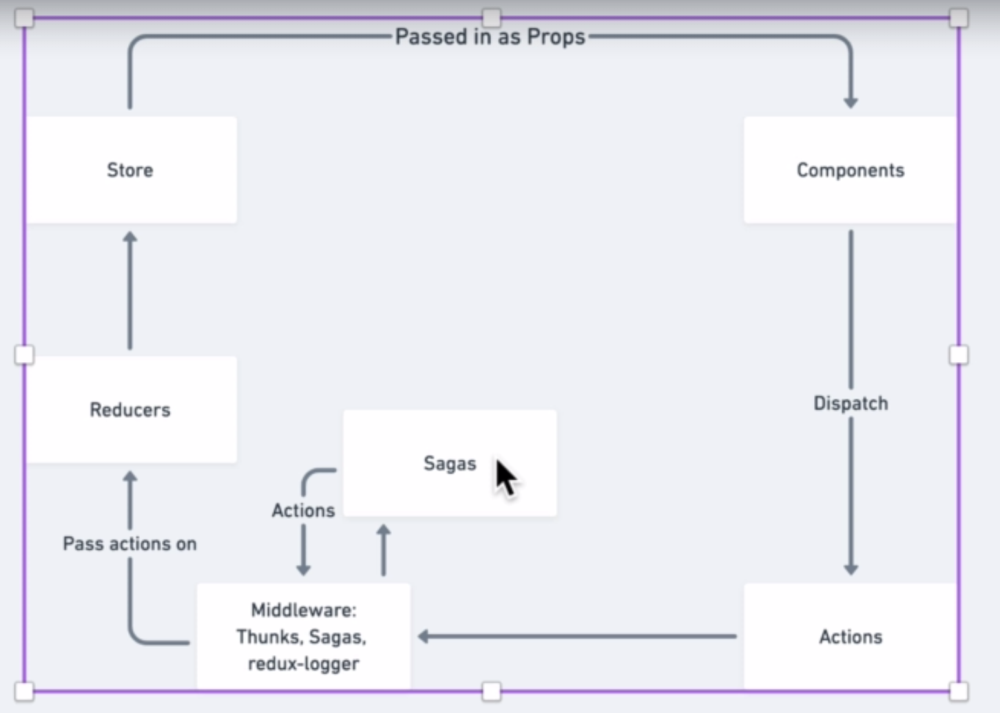

# Redux Saga
- Redux Saga is quite tough concept but not a great thing. The power Redux Saga gives is a lot. Sagas are pieces of code which act as a middleware functions and listen to all redux action calls. These functions execute only to a particular set of actions, hence, each saga can be associated with a set of actions and made to execute only for those actions.
- Now, what can we make it execute, well, there is a lot of things we can make it execute. One of the best things to do is use saga for asynchronous code executions or in general make it run side-effect codes.

- As seen in the figure, Sagas sit as a middleware and incepts the actions, firing the saga code for a set of actions it is meant to fire for.


## What is side effect codes:
- These can range from async code that fetches something from the backend or something that triggers an impure reaction.
- A pure code/function is a set of code which always gives the same output for the same set of inputs eg. Add(2, 3) will always give 5.
- A impure code/function is a set of code which will give different output for the same sef of inputs. How can this happen? Simple. Take a look at this code:
```js
let num = 5
const AddNumbers = (a, b) => {
    return (a + b + num);
};

console.log(AddNumbers(5, 4)); // output: 14
// change the num
num = 10;
console.log(AddNumber(5, 4)); // output: 19
```
- As we can see, how the `AddNumber()` function is a impure function and it is impure due to the external dependency it had with the `num` variable. As the `num` changes, the output changes for the same set of inputs.
- This external dependencies are similar to API request where the request input is same but the output changes each time due to the volatile nature of the output. This is the reason why Sagas were created. To handle such impure calls and async functions seamlessly without any hassle.
- Any async activities which is not related to a single component but the entire App execution depends on it, then we call such calls in a Saga and it is beneficial to call it in Saga.

## Generator Function - Building block for Sagas
- This is a new function introduced in the JS function. It is a type of function which keeps on giving out (`yields`) outputs. These functions doesn't have a return statement rather these have a yield statement which constantly returns outputs in a asynchronous fashion.
- A basic generator function is written in the following manner.

```js
// the generator function
function* generatorFunction() {
    console.log('a');
    console.log('b');
}

// gets a generator object
const g = generatorFunction();

// runs the generator function 1 time and returns an object
g.next();
```
- The function shown above is a basic generator with no return or yield. A generator object doesn't execute just like a normal function. We need to first initialize it to a variable like `g` in our case. Then, the `g` holds the thread that is associated to execute the function. Now to execute it, call `g.next()`. This executes the code and returns an object of the following type.
```js
{
    value: undefined,
    done: true,
}
```
- The value is the returned value of the generator and the done is a status boolean that tells if the function is executed completely or not. If a function is executed completely, then done is toggled as true and the function will not be executed again. Calling `g.next()` again will not do those `console.log`s anymore and will always return this object.

### Yield vs. Return:
- `yield` is a keyword like return but it doesn't end the function. Rather it suspends the generator by returning a value - This means we can resume the generator function with the `g.next()`. An example:
```js
function* addNumber(a, b, error) {
    yield a + b;
    yield a + b + error;
    return error;
};
const a = addNumber(5, 4, 10);

console.log(a.next());
console.log(a.next());
console.log(a.next());
```
- From the above code, the first `a.next()` returns the object 
```js 
{
    value: 9,
    done: false,
}
```
- The second `a.next()` executes till the next yield and then again suspends the generator function by returning the yield value as such
```js
{
    value: 19,
    done: false,
}
```
- The third `a.next()` executes till the next yield, but there is no yield. Instead, there is a return value. Now, the generator execution is closed and the return value is returned as such:
```js
{
    value: 10,
    done: true,
}
```
- As u can see, the done is toggled as true for the return statement. Anymore `a.next()` will always return the following object:

```js
{
    value: undefined,
    done: true,
}
```
- This is how yield works. It allows the generator function to run in a suspended state and doesn't close the generator function. 
- yield allows us to kinda pause the function and resume it later...kinda like that
- The redux saga is kinda like this, it allows us to pause an execution of a code - do something - resume again - pause again - do something - so on.......

