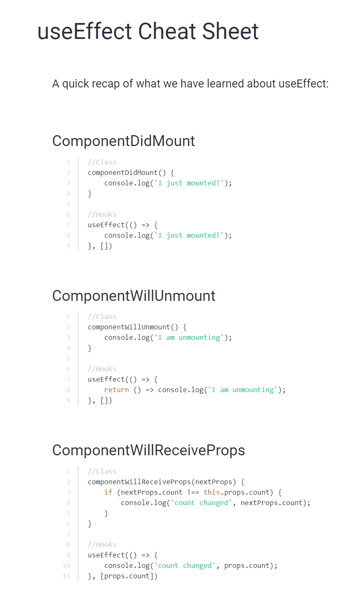

# React Hooks
- Introduced in 2019, this is a new intuitive way to develop the components of a react application
- React hooks are functionalities extended by React which allows us to use states in a functional component.
- Earlier, state and life cycle methods were only available to react class based components. Now, with hooks, we can access them in functional components itself.
- The few main advantage of this is that we can have cleaner, simpler and more readable code + testing/Jesting is easier with functions than classes.
- NOTE: Hooks are available only for React v16.8+

## Hooks basics
- There are multiple hooks in React. Lets review all the hooks

### Hook 1 - useState()
- This hook allows us to initialize a state variable in the functional component.
- `useState()` functional hook gives us two variables back as a single array - so we have to access those two variable by using array destructuring.
- For example, if we want a state variable `name`. Then:
```js
const [name, setName] = useState("Joel");

// The name is the state variable
// The setName is a function that allows us to change the state variable.
setName("Raymann") // changes the state 'name: "Raymann"'.
// NOTE: A change in state causes re-render of the component.
```
- The above is how we use the `useState()` function. Lets just take a simple component which will change a variable `name` on click of a button. Lets see how this is in normal class component vs react hooks
```js
import React, { useState } from "react";

// Class component
class ClassComponent extends React.Component {
    constructor(props) {
        super();

        this.state = {
            name: "Joel",
            address: "India",
        };
    }

    render() {
        const { name, address } = this.state;
        return (
            <h1>{`${name}`}</h1>
            <h1>{`${address}`}</h1>
            <button onClick={this.setState({ name: "Raymann" })}>
              Set name to Raymann
            </button>
            <button onClick={this.setState({ address: "Canada" })}>
              Set new country to Canada 
            </button>
        );
    }
}


// Hook component
function HookComponent(props) {
    // define the states here
    const [name, setName] = useState("Joel");
    const [country, setCountry] = useState("India");

    return (
        <h1>{`${name}`}</h1>
        <button onClick={() => setName("Raymann")}>
            Set name to Raymann
        </button>
        <button onClick={() => setCountry("Canada")}>
            Set new country to Canada 
        </button>
    );
}
```
- From the above example, it is clear that react hooks are easier and simpler than a class based component.
- All hooks are pretty simple but there are caviats on how to use it, this is perhaps the easiest hook. NOTE: hooks can't be used in class components and it has a set of rules which have to be followed. Those rules will be discussed later.

### Hook 2: useEffect() hook
- This hook allows us to simulate the life cycle functions in the class component letting us run side-effect code.
- `useEffect()` hook takes a function as its argument and fires it whenever the component is rendered. This means it will be fired when the component is mounted and when the component is updated.
- Ok! now how will I make it behave like `componentDidMount()`. This is simple, `useEffect()` takes a second argument which is an array.
- This array is a list of state variables. The useEffect() will be launched only if there is a change to these state variables. For example,

```js
const [name, setName] = React.useState("Joel");

useEffect(() => {
    console.log("hello");
}, [name]);
```
- In the above code, a call to `setName()` function alone will trigger the `useEffect()`. Hence, we have more control over how our components behave now.

#### useEffect as componentDidMount()
- Wait, this is awesome but where is `componentDidMount()`? Well, this is simple, just send a empty array as the second argument and thats all, the `useEffect()` will be fired only once when the component is mounted, afterwards, it will not be fired as it is controlled by a `undefined` set of state variables - a.k.a - it is controlled by things which are not even defined, hence, no chance to be fired at all.
- So why is it firing after the component is mounted? Simple, because all `useEffect()` function will fire when the component is mounted. This will happen regardless whether the there is a second arg or not.

#### useEffect as componentDidUnmount()
- useEffect mimics the componentDidUnmount() method by allowing us to return a cleanup function within the function we send as first param to the `useEffect()` hook.
- On unmount, this function would be called for cleaning up.

```js
useEffect(() => {
    const unsub = auth.onStateChanged(); // some code

    // return the cleanup function
    return () => {
        // write cleanup here
        unsub.clean();
    }
}, []); 
```

#### How to run side-effects/async with useEffect()
- This is a bit different, we CAN'T DO THIS!!!!:
```js
const [name, setName] = React.useState("Joel");

useEffect(async () => {
    const response = await fetch("API");
    const data = await response.json();
    setName(data);
}, []); // ERROR!!!!!
```
- The above is a ERROR. We can't do that as async function returns a promise and our `useEffect()` hook requires a function as its first argument. Hence, we have to define a async function within the function and call it in there itself - resolve it. 
- An example is as such:

```js
const [name, setName] = React.useState("Joel");

useEffect(() => {
    const fetchFunc = async () => {
        const response = await fetch("API");
        const data = await response.json();
        setName(data);
    }
   
   fetchFunc();
}, []);
```
- This is how async functions are executed. Now, u need to remember one thing, we really don't want to run this `useEffect()` infinite times but this is a possibility if we remove the empty array argument. SO PLEASE BE BEWARE OF THAT.

#### CheatSheet of useEffect()


### The rules of writing hooks
1. The hooks have to always be at the top level of the functional component - This means that it cannot be defined within a if-else condition or within a for loop. It has to be outside any conditionals and looping. Don’t call Hooks inside loops, conditions, or nested functions. Instead, always use Hooks at the top level of your React function. By following this rule, you ensure that Hooks are called in the same order each time a component renders. That’s what allows React to correctly preserve the state of Hooks between multiple useState and useEffect calls.
2. Only Call Hooks from React Functions
Don’t call Hooks from regular JavaScript functions. Instead, you can:

✅ Call Hooks from React function components.
✅ Call Hooks from custom Hooks.
By following this rule, you ensure that all stateful logic in a component is clearly visible from its source code.

